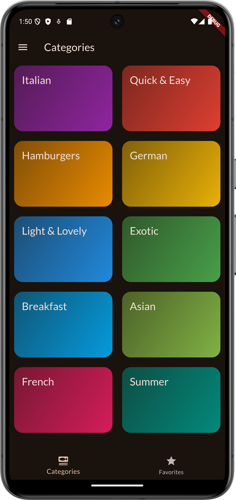
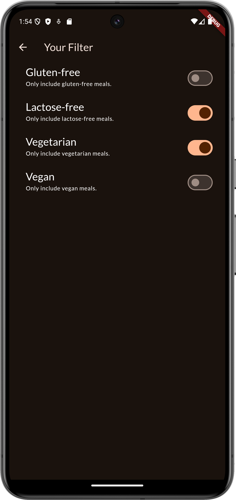

# Daily Recipe

Daily Recipe is a simple and user-friendly application designed to help you manage your daily shopping needs efficiently. With this app, you can add, categorize, and delete bazar items with ease.

# Features
- Discover Recipes: Browse through an extensive collection of recipes from various cuisines and cultures. 
- Filter Options: Easily find the perfect recipe by filtering based on criteria such as ingredients, cuisine, meal type, dietary restrictions, preparation time, and more. 
- Bookmark Favorites: Save your favorite recipes for quick access and future reference. 
- User-friendly Interface: Enjoy a clean, intuitive design that makes recipe searching and saving a breeze. 
- Responsive Design: Access Daily Recipe on any device, whether you're in the kitchen or on the go.
- 
Built entirely in Flutter for a robust and efficient multiplatform codebase. Leverage the power of Kotlin to ensure a smooth and responsive user experience. How to Get Started : Clone the Repository :

bash Copy code git clone https://github.com/RaihanRafi01/Daily-Recipe.git Setup the Development Environment :

Ensure you have the latest version of Flutter installed. Open the project in any IDE and configure the necessary dependencies. Run the App :

Build and run the app on your preferred Android device / Emulator or  IOS Emulator. Explore and Contribute :

Explore the codebase and discover the functionalities. Contribute to the project by fixing bugs, adding new features, or improving existing ones. Contributing : Contributions are welcome! Whether you're a seasoned Kotlin developer or just getting started, there are plenty of ways to contribute to Daily Recipe App. Check out the contribution guidelines to get started.

Feedback : We value your feedback! If you encounter any issues, have suggestions, or want to share your experience, please open an issue on GitHub.

Thank you for choosing Daily Recipe App to simplify your daily activities. Let's make each day more productive together!

Here are some Screenshots!

